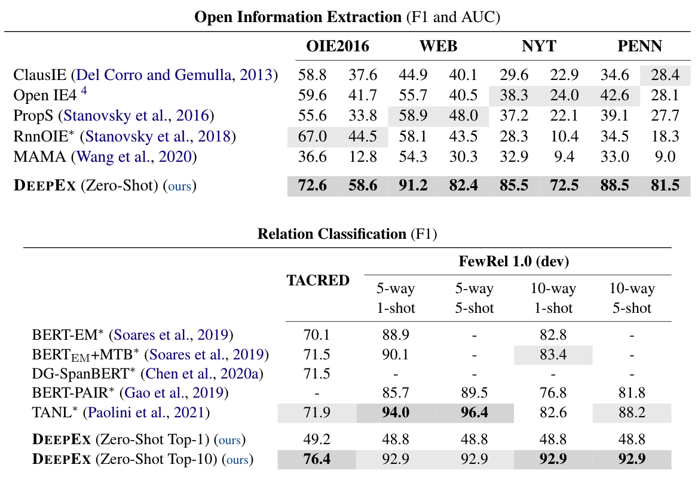

# Zero-Shot Information Extraction as a Unified Text-to-Triple Translation

Source code repo for paper [Zero-Shot Information Extraction as a Unified Text-to-Triple Translation](https://arxiv.org/pdf/2109.11171.pdf), EMNLP 2021.

## Installation

```bash
git clone --recursive git@github.com:cgraywang/deepex.git
cd ./deepex
conda create --name deepex python=3.7 -y
conda activate deepex
pip install -r requirements.txt
pip install -e .
```

Requires PyTorch version 1.5.1 or above with CUDA. PyTorch 1.7.1 with CUDA 10.1 is tested. Please refer to https://pytorch.org/get-started/locally/ for installing PyTorch.

## Dataset Preparation

### Relation Classification

#### FewRel

You can add `--prepare-rc-dataset` argument when running the scripts in [this section](#scripts-for-reproducing-results), which would allow the script to automatically handle the preparation of FewRel dataset.

Or, you could manually download and prepare the FewRel dataset using the following script:

```bash
bash scripts/rc/prep_FewRel.sh
```
The processed data will be stored at `data/FewRel/data.jsonl`.

#### TACRED

TACRED is licensed under LDC, please first download TACRED dataset from [link](https://catalog.ldc.upenn.edu/LDC2018T24). The downloaded file should be named as `tacred_LDC2018T24.tgz`.

**After downloading and correctly naming the tacred `.tgz` data file**, you can add `--prepare-rc-dataset` argument when running the scripts in [this section](#scripts-for-reproducing-results), which would allow the script to automatically handle the preparation of TACRED dataset.

Or, you could manually download and prepare the TACRED dataset using the following script:

```bash
bash scripts/rc/prep_TACRED.sh
```
The processed data will be stored at `data/TACRED/data.jsonl`.

## Scripts for Reproducing Results

This section contains the scripts for running the tasks with default setting (e.g.: using model `bert-large-cased`, using 8 CUDA devices with per-device batch size equal to 4).

To modify the settings, please checkout [this section](#arguments).

### Open Information Extraction
```bash
bash tasks/OIE_2016.sh
```
```bash
bash tasks/PENN.sh
```
```bash
bash tasks/WEB.sh
```
```bash
bash tasks/NYT.sh
```

### Relation Classification
```bash
bash tasks/FewRel.sh
```
```bash
bash tasks/TACRED.sh
```

## Arguments
General script:
```bash
python scripts/manager.py --task=<task_name> <other_args>
```

The default setting is:
```bash
python scripts/manager.py --task=<task_name> --model="bert-large-cased" --beam-size=6
                          --max-distance=2048 --batch-size-per-device=4 --stage=0
                          --cuda=0,1,2,3,4,5,6,7
```

All tasks are already implemented as above `.sh` files in `tasks/`, using the default arguments.

The following are the most important command-line arguments for the `scripts/manager.py` script:
- `--task`: The task to be run, supported tasks are `OIE_2016`, `WEB`, `NYT`, `PENN`, `FewRel` and `TACRED`.
- `--model`: The pre-trained model type to be used for generating attention matrices to perform beam search on, supported models are `bert-base-cased` and `bert-large-cased`.
- `--beam-size`: The beam size during beam search.
- `--batch-size-per-device`: The batch size on a single device.
- `--stage`: Run task starting from an intermediate stage:
    - `--stage=0`: data preparation and beam-search
    - `--stage=1`: post processing
    - `--stage=2`: ranking
    - `--stage=3`: evaluation
- `--prepare-rc-dataset`: If true, automatically run the relation classification dataset preparation scripts. Notice that this argument should be turned on only for relation classification tasks (i.e.: `FewRel` and `TACRED`).
- `--cuda`: Specify CUDA gpu devices.

Run `python scripts/manager.py -h` for the full list.

## Results



**NOTE**

We are able to obtain improved or same results compared to the paper's results. We will release the code and datasets for factual probe soon!

## Related Work

We implement an extended version of the beam search algorithm proposed in [Language Models are Open Knowledge Graphs](https://arxiv.org/pdf/2010.11967.pdf) in [src/deepex/model/kgm.py](https://github.com/cgraywang/deepex/blob/main/src/deepex/model/kgm.py).

## Citation

```bibtex
@inproceedings{wang-etal-2021-deepex,
    title = "Zero-Shot Information Extraction as a Unified Text-to-Triple Translation",
    author = "Chenguang Wang and Xiao Liu and Zui Chen and Haoyun Hong and Jie Tang and Dawn Song",
    booktitle = "Proceedings of the 2021 Conference on Empirical Methods in Natural Language Processing",
    year = "2021",
    publisher = "Association for Computational Linguistics"
}

@article{wang-etal-2020-language,
    title = "Language Models are Open Knowledge Graphs",
    author = "Chenguang Wang and Xiao Liu and Dawn Song",
    journal = "arXiv preprint arXiv:2010.11967",
    year = "2020"
}
```